# ⚡ Eventra — Find Events. Build Your Dream Team.

> A web-based platform for event discovery and team collaboration. Discover hackathons, competitions, and projects — connect with teammates and build something extraordinary.

---

## 📸 Screenshots

<!-- Add your screenshots here -->
## Landing Page
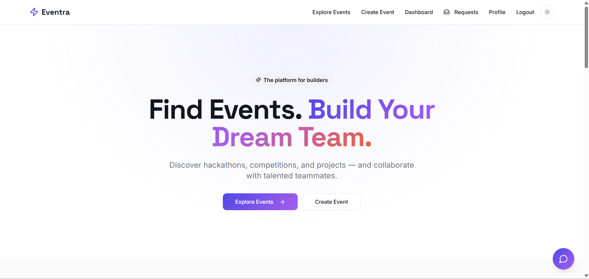 
## Explore Events
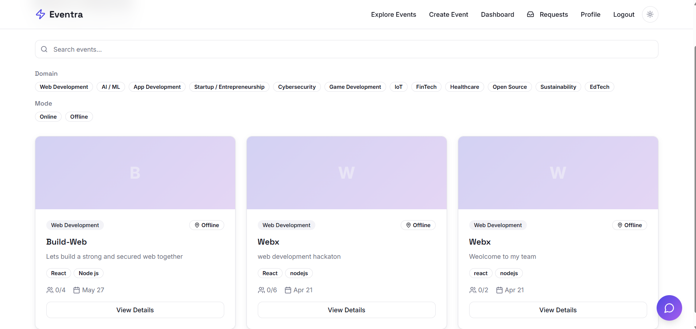 
## Dashboard
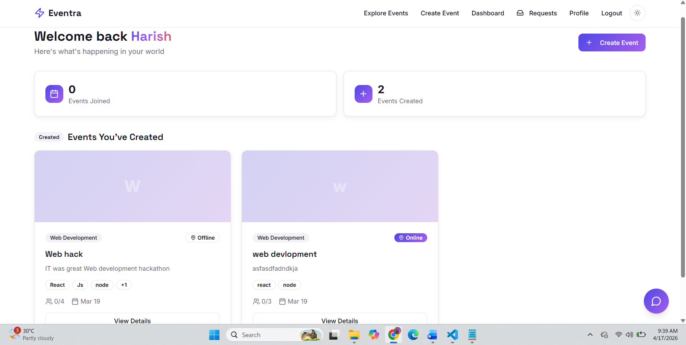 
## profile
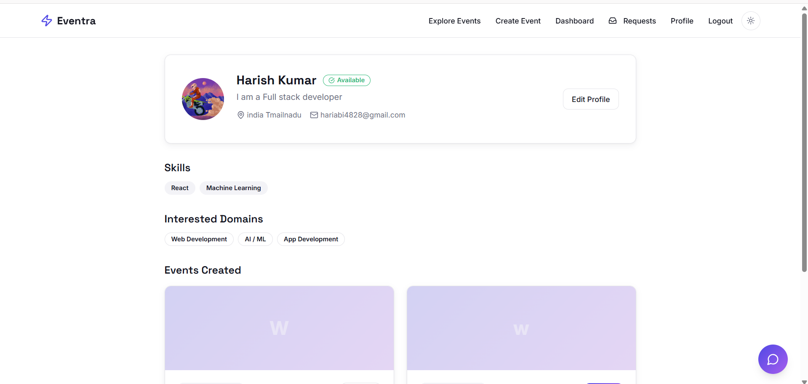 
## Send request
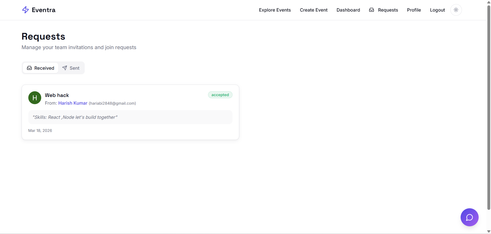
## Receive request
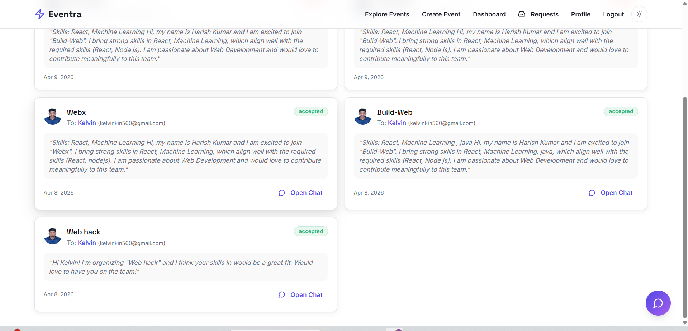 
## eventdetails
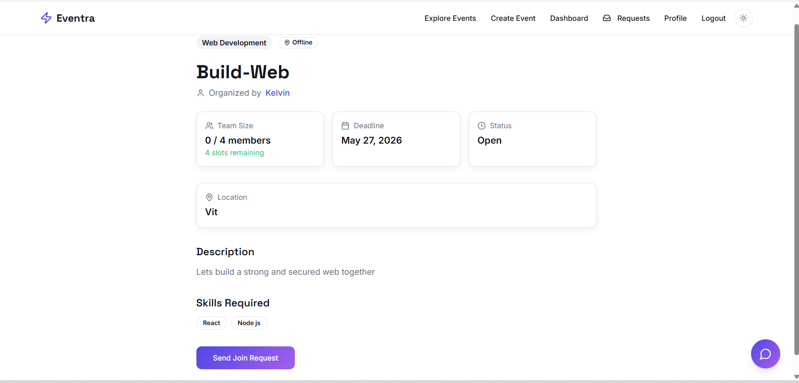 
## editevent
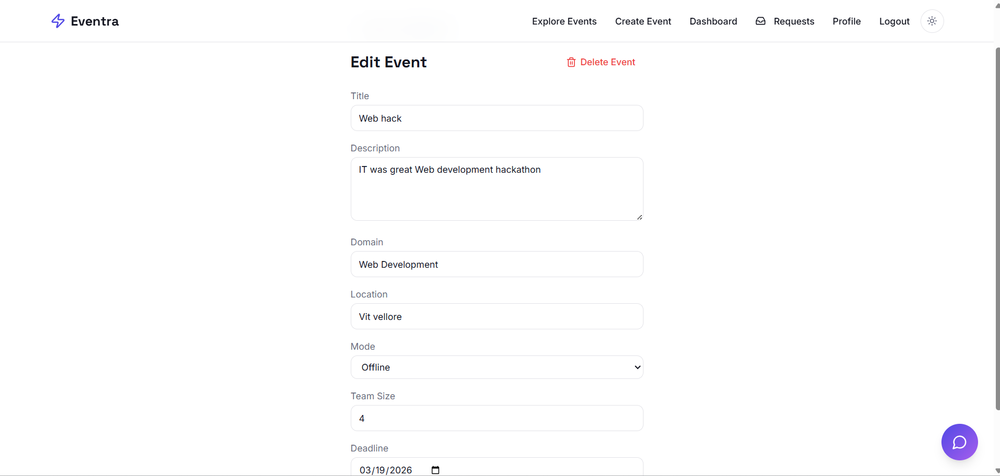 
## sendjoinrequest
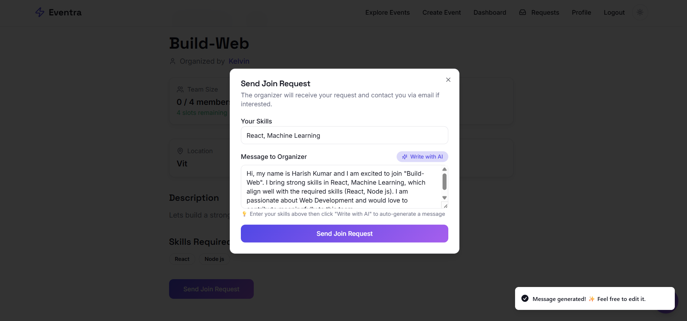 
## findteamwithai
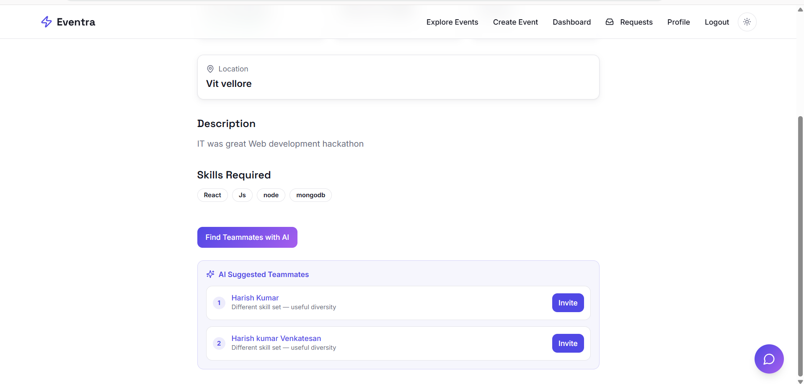
## createevent
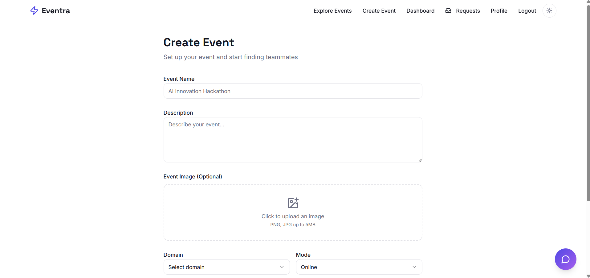


---


## ✨ Features

### 🤖 AI-Powered
- **Write with AI** — Auto-generates a personalized join request message based on your skills and the event requirements
- **AI Teammate Matcher** — Ranks all users by skill compatibility with your event so you can invite the best candidates
- **AI Event Recommender** — Shows events matching your skill set with a "skills match" badge on the Explore page

### 💬 Real-Time Chat
- Instagram-style sidebar chat accessible from every page
- Message **reply** and **delete** support
- Unread message badges with real-time count updates
- Floating chat button with total unread indicator

### 🎯 Event Management
- Create events with title, description, skills required, team size, deadline, mode, and image
- **Duplicate event detection** — warns you if a similar event exists and lets you join it or create your own
- Filter events by domain and mode
- Expired and own events automatically hidden from Explore

### 👥 Team Formation
- Send join requests with AI-generated or custom messages
- Organizers can accept/reject requests and view full applicant profiles
- Chat room auto-created on acceptance

### 👤 Profiles
- Comprehensive profile with skills, interests, bio, location, GitHub, LinkedIn, and portfolio
- View any user's profile by clicking their name anywhere on the platform
- "Open to Team Up" availability badge

### 🎨 UI/UX
- Dark and light theme with persistent preference
- Fully responsive across all screen sizes
- Smooth animations with Framer Motion

---

## 🛠️ Tech Stack

| Layer | Technology |
|---|---|
| Frontend | React 18 + TypeScript + Vite |
| Styling | Tailwind CSS + shadcn/ui |
| Routing | React Router DOM v6 |
| State | TanStack Query + React Context |
| Backend | Supabase (PostgreSQL + Auth + Realtime) |
| AI | Anthropic Claude API via Supabase Edge Functions |
| Animations | Framer Motion |
| Icons | Lucide React |

---

## 📁 Project Structure

```
src/
├── components/
│   ├── chat/
│   │   ├── ChatSidebar.tsx       # Slide-in chat panel
│   │   └── FloatingChatButton.tsx
│   ├── ui/                       # shadcn/ui components
│   ├── EventCard.tsx
│   └── Navbar.tsx
├── contexts/
│   └── ChatContext.tsx           # Global chat state + realtime
├── lib/
│   └── auth-context.tsx          # Auth state + profile
├── pages/
│   ├── Index.tsx                 # Landing page
│   ├── ExploreEvents.tsx         # AI event recommendations
│   ├── EventDetails.tsx          # Join request + AI message writer
│   ├── Dashboard.tsx             # AI teammate matcher
│   ├── Requests.tsx              # Accept/reject requests
│   ├── Chat.tsx                  # Full-screen chat
│   ├── UserProfile.tsx           # Public profile view
│   └── CreateEvent.tsx           # Duplicate detection
└── main.tsx
```

---

## 🗄️ Database Schema

```
profiles          — id, name, email, skills[], interests[], bio, avatar_url
events            — id, title, description, skills_required[], deadline, organizer_id
event_requests    — id, event_id, sender_id, receiver_id, message, status, chat_room_id
chat_rooms        — id, created_at
chat_participants — chat_room_id, user_id
messages          — id, chat_room_id, sender_id, message_text, created_at
```

---


<p align="center">Built with ❤️ using React, Supabase</p>
